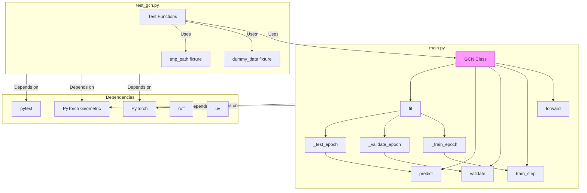

# System Patterns: GCN Starter

## Architecture

-   **Model Definition (`main.py::GCN`)**: Encapsulates the GCN layers and forward pass logic. Follows standard PyTorch `nn.Module` structure. Uses `GCNConv` layers from `torch_geometric.nn`.
-   **Training Loop (`main.py::GCN::fit`)**: Orchestrates the training process over multiple epochs.
    -   Uses a `DataLoader` (from `torch_geometric.loader`) for batching.
    -   Includes helper methods (`_train_epoch`, `_validate_epoch`, `_test_epoch`) for clarity.
    -   Implements early stopping based on validation loss.
    -   Saves the best model checkpoint.
    -   Logs metrics to a CSV file (`mlflow_log.csv`).
-   **Prediction (`main.py::GCN::predict`)**: Provides a simple interface for generating predictions on new data.
-   **Unit Testing (`test_gcn.py`)**: Uses `pytest` to test individual components and the overall training process.
    -   Employs fixtures (`dummy_data`) for test data generation.
    -   Uses `tmp_path` fixture for temporary file creation during testing (e.g., checkpoints, logs).
-   **Dependency Management**: Uses `uv` and `requirements.txt`.
-   **Code Formatting/Linting**: Uses `ruff`.
-   **Automation**: `.clinerules` file triggers `pytest` and `ruff format` on file changes.

## Key Technical Decisions

-   **PyTorch Geometric**: Chosen as the core library for graph neural network components due to its widespread adoption and comprehensive features.
-   **Standard PyTorch Structure**: Adhering to `nn.Module` and standard training loop patterns for familiarity and compatibility.
-   **CSV Logging**: Simple CSV logging chosen for basic metric tracking, compatible with MLflow's `log_artifact`.
-   **Basic Early Stopping**: Implemented a simple patience-based early stopping mechanism.
-   **`uv` for Dependencies**: Adopted `uv` as requested for package management.
-   **`ruff` for Formatting**: Adopted `ruff` as requested for code formatting.

## Component Relationships

## Critical Implementation Paths

-   Data loading and batching via `torch_geometric.loader.DataLoader`.
-   Correct implementation of the `forward` pass using `GCNConv` layers.
-   Integration of training, validation, testing, prediction, logging, and checkpointing within the `fit` method and its helpers.
-   Ensuring `pytest` tests cover essential functionalities.
